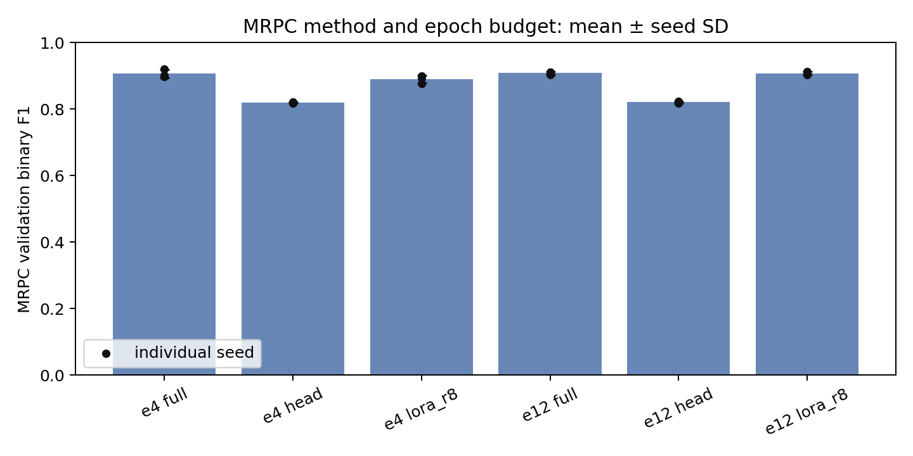
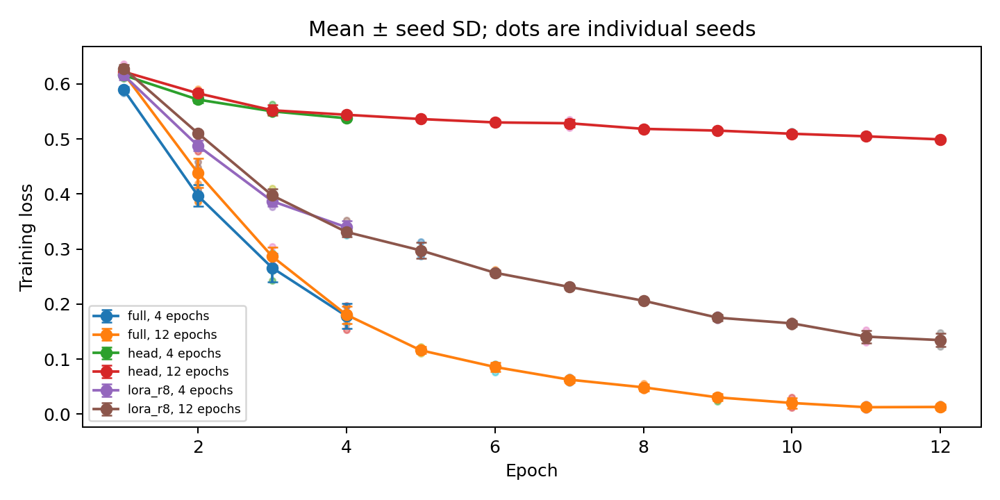
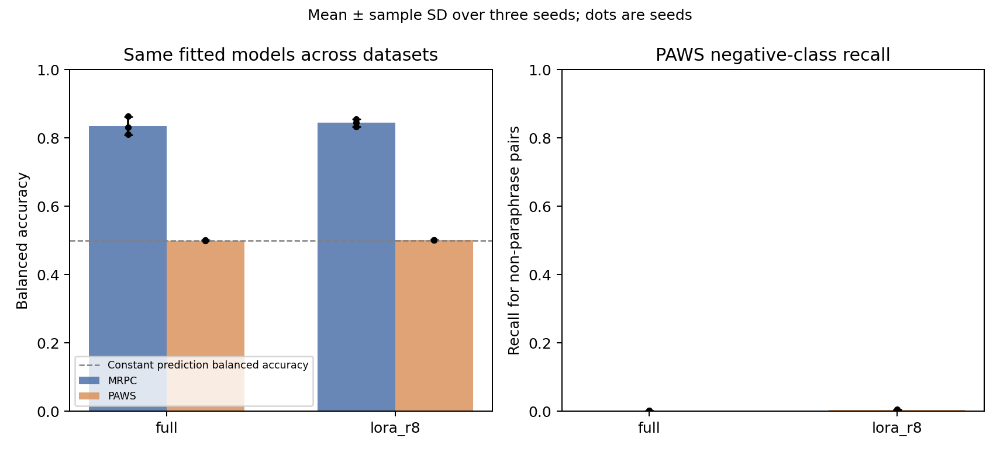

# LoRA 的参数效率能否同时保住常规效果与词序鲁棒性？

**状态：独立分析完整。**

**主要发现：**12轮时 LoRA-r8 的 MRPC 三种子平均 F1 为 0.9074，full 为 0.9081；同六个模型在 PAWS 的平均 balanced accuracy 分别为 0.5009、0.5003，接近常量分类基线 .5。在这组实验中，参数高效微调保留了接近全量微调的常规分数，但两者都没有在压力集上表现出可靠的词序区分能力；小幅分差不构成方法等效性证明。

## 问题与输入纠错

本实验研究输入正确后，微调方式与训练预算如何影响 MRPC 句对判断，并检查这些已选模型在 PAWS 高词汇重叠句对上是否仍能区分语义差异。主比较是分类头训练、全量微调、query/value LoRA-r8；预算为 4 与 12 epoch，各做三个训练种子。

v3 采用的 legacy RobertaTokenizerFast 在固定环境中构造出零 BPE merges 的后端，4,076 条 MRPC 句对全部与原始 tokenizer.json 编码不符，绝大多数因字符级切分超过 128 token。v3 的正常微调性能解释已撤回；此错误来自本项目输入入口与核验遗漏，不归咎于上游未经验证的缺陷。

v4 使用 AutoTokenizer，并逐条与原始 tokenizers.Tokenizer 对照实际缓存的 input_ids、attention_mask 和 label。正确编码的 MRPC 样本没有超过 128 token；PAWS 8,000 行也逐条验证，其中 2 行超过 128，并按预设规则截断。PAWS 与 MRPC 无规范化无序句对的精确交集；这不等于语义或预训练数据完全独立。

## 方法、选择与原论文差异

固定 RoBERTa-base revision 与 MRPC revision；官方训练集分为 2,934 条梯度训练、734 条内部开发。每个 epoch 按内部开发 F1、accuracy、最早 epoch 依次选优；官方 408 条 validation 用于最终评价。该公开验证集此前已被查看，所有扩展按探索性研究解释。未下载 MRPC 官方 test。

仅训练分类头的基线先冻结编码器，缓存 eval-mode 编码器特征，再训练原 dense/tanh/dropout 头；全量微调更新全部参数；LoRA 更新 24 个 query/value 投影中的低秩矩阵及分类头。ΔW=(alpha/r)BA，每个投影新增 r(d_in+d_out) 参数，alpha=2r。固定方法学习率分别为 .001、2e-5、4e-4，有效 batch=32，长度128，BF16，AdamW。

4 与 12 epoch 使用各自完整的线性 warmup/decay 日程，因此预算对照不是在同一条轨迹上截取第4轮。r2/r16 各仅 seed42；它们提供机制诊断，不用于选择“最优秩”。原作者 MRPC 脚本使用 MNLI 适配后的初始化、30轮、长度512和多卡配置，且论文汇总口径不同，本实验不复制原论文表格。来源：[LoRA论文](https://arxiv.org/abs/2106.09685)、[固定作者脚本](https://github.com/microsoft/LoRA/blob/c4593f060e6a368d7bb5af5273b8e42810cdef90/examples/NLU/roberta_base_mrpc.sh)。

## MRPC 主结果

下表为三个训练种子的均值 ± 样本标准差；每项均在相同408条句对上评估。SD 表示有限训练种子差异，不是总体置信区间。

|方法/预算|F1|Accuracy|Balanced accuracy|负类召回|MCC|
|---|---:|---:|---:|---:|---:|
|head-e4|0.8193 ± 0.0020|0.7157 ± 0.0049|0.5837 ± 0.0098|0.2248 ± 0.0233|0.2483 ± 0.0196|
|full-e4|0.9065 ± 0.0118|0.8693 ± 0.0181|0.8363 ± 0.0286|0.7468 ± 0.0582|0.6916 ± 0.0454|
|lora_r8-e4|0.8896 ± 0.0112|0.8464 ± 0.0204|0.8134 ± 0.0418|0.7235 ± 0.1000|0.6397 ± 0.0581|
|head-e12|0.8207 ± 0.0023|0.7165 ± 0.0093|0.5815 ± 0.0242|0.2145 ± 0.0650|0.2482 ± 0.0414|
|full-e12|0.9081 ± 0.0049|0.8709 ± 0.0099|0.8355 ± 0.0272|0.7390 ± 0.0753|0.6960 ± 0.0288|
|lora_r8-e12|0.9074 ± 0.0050|0.8717 ± 0.0075|0.8444 ± 0.0116|0.7700 ± 0.0237|0.6996 ± 0.0188|

验证集正类 279/408。恒预测正类的 F1 为 0.812227、accuracy 为 0.683824、balanced accuracy 为 .5。因此单看 F1 不足以评价少数负类。

4轮时 LoRA−全量微调的三种子平均 F1 差为 -0.016886。这是本固定协议下的描述差异，不能由小差值直接宣称两者等效或 LoRA 普遍更优。

12轮时 LoRA−全量微调的三种子平均 F1 差为 -0.000715。这是本固定协议下的描述差异，不能由小差值直接宣称两者等效或 LoRA 普遍更优。

## 预算、拟合与配对不确定性

|方法|12−4轮 平均F1变化|三个seed的配对差值|12轮所选epoch|
|---|---:|---|---|
|head|+0.001379|42: +0.0020, 123: +0.0013, 456: +0.0008|[8, 9, 5]|
|full|+0.001577|42: +0.0103, 123: -0.0100, 456: +0.0045|[9, 11, 5]|
|lora_r8|+0.017748|42: +0.0144, 123: +0.0126, 456: +0.0262|[9, 9, 12]|

对每个固定种子的两个模型，在相同验证样本上配对 bootstrap 2,000 次，保持种子预设。以下给出 LoRA−全量的 F1 差和95%百分位区间；完整六指标及预算配对在 analysis.json。区间条件于已拟合模型和当前样本集合，不包含重新选参、训练种子总体或领域迁移不确定性。多项探索性比较未作多重检验校正。

|预算|训练seed|观察F1差|95%配对区间|
|---|---:|---:|---|
|4|42|-0.002858|[-0.024358, +0.018519]|
|4|123|-0.026833|[-0.048550, -0.006657]|
|4|456|-0.020967|[-0.044592, +0.000383]|
|12|42|+0.001255|[-0.017150, +0.019806]|
|12|123|-0.004173|[-0.024090, +0.016763]|
|12|456|+0.000775|[-0.017203, +0.020179]|

|12轮方法|选优模型训练F1均值|内部dev F1均值|官方validation F1均值|
|---|---:|---:|---:|
|head|0.8338|0.8293|0.8207|
|full|0.9951|0.9002|0.9081|
|lora_r8|0.9722|0.8933|0.9074|

内部 dev 和官方 validation 来自不同划分，样本难度未必相同；dev 用于选 epoch，本表仅诊断拟合差距，不把 validation 比 dev 高误读为不存在过拟合。

## PAWS：常规分数之外的词序压力

[PAWS](https://arxiv.org/abs/1904.01130) 构造高词汇重叠、词序和句意关系困难的句对。固定六个12轮 full/LoRA 模型的 MRPC 内部 dev 选优 checkpoint 后，才进行 PAWS-Wiki labeled_final 公开 test 的零样本评价；没有 PAWS 训练、选 epoch 或阈值调优。它是特定压力集，不能代表所有真实场景。

逐条压力预测审计状态：`COMPLETE`。

|方法|Accuracy|F1|Balanced accuracy|负类召回|正类召回|MCC|
|---|---:|---:|---:|---:|---:|---:|
|full|0.4425 ± 0.0004|0.6130 ± 0.0001|0.5003 ± 0.0003|0.0016 ± 0.0008|0.9990 ± 0.0002|0.0073 ± 0.0074|
|lora_r8|0.4433 ± 0.0005|0.6131 ± 0.0000|0.5009 ± 0.0004|0.0040 ± 0.0016|0.9979 ± 0.0009|0.0166 ± 0.0032|

该集合有4,464条负类、3,536条正类。恒预测负类 accuracy=.558，恒预测正类 F1约.613；两者 balanced accuracy均=.5，MCC在本实现零分母约定下记0。压力结果应优先结合 balanced accuracy 与负类召回，不能只比较 F1。

六个模型的正类召回都接近1，负类召回都低于.006，几乎把所有句对判为同义；约.613的F1因此不表示有效识别了非同义句对。这一负面结果限制了MRPC成绩的外推。它与词汇重叠、训练标签比例或数据迁移有关的解释仍是假设，当前实验没有分离各因素的因果作用。表内四位小数可能把很小的SD显示为.0000，完整精度保留在JSON。

## 错误分层与低秩机制

词汇重叠由小写词集合 Jaccard 衡量，仅作描述性分层；不是“理解语义”的直接测量。固定顺序选取的事后失败案例包含第三方数据集原句，未纳入公开仓库；完整复跑可由 error_cases.py 重新生成。以下显示12轮每方法在各层的三种子平均错误率，n为验证句对数，三个seed不使样本量翻三倍。

|分层|n|head错误率|full错误率|LoRA错误率|
|---|---:|---:|---:|---:|
|gold_0|129|0.7855|0.2610|0.2300|
|gold_1|279|0.0514|0.0681|0.0812|
|jaccard_[0,.5)|176|0.4318|0.1818|0.1932|
|jaccard_[.5,.8)|206|0.1877|0.0955|0.0841|
|jaccard_[.8,1]|26|0.0385|0.0385|0.0385|
|length_<=64|314|0.3068|0.1348|0.1359|
|length_65_128|94|0.2057|0.1099|0.1028|
|length_>128|0|N/A|N/A|N/A|

|12轮rank诊断（seed42）|F1|可训练参数含头|24个投影平均相对更新范数|95%能量秩均值|
|---|---:|---:|---:|---:|
|lora_r2|0.9045|665,858|0.025532|1.25|
|lora_r8|0.9130|887,042|0.042023|2.54|
|lora_r16|0.9056|1,181,954|0.038529|3.46|

相对范数为 ||ΔW||F/||W||F；能量秩按奇异值平方累计计算。数值秩的阈值固定1e-8，另存99%能量秩与熵有效秩。低秩结构由参数化强制形成，不能把“秩低”本身当成任务具有内在低维结构的实验证明；各层也不是独立训练重复。

## 参数、成本与重复

|12轮方法|可训练参数|峰值CUDA分配GiB均值|端到端秒数均值|
|---|---:|---:|---:|
|head|592,130|0.566|24.9|
|full|124,647,170|2.674|387.9|
|lora_r8|887,042|1.126|296.1|

LoRA-r8 含头可训练参数较 full 减少 99.288%。这不是总模型存储量或运行时间按相同比例减少；冻结编码器仍参与前向和反向传播所需的计算。时间包含方法相关的特征缓存、评价、权重保存与恢复，显存为 PyTorch allocator峰值，不是整机峰值，均不能当严格硬件基准。

从头重复 `lora_r8-e4-seed42` 的状态为 **PASS**：检查逐条预测、logits、checkpoint SHA、预测 SHA 和所选 epoch。仅证明这一配置在当前宿主环境的重复一致性，未验证不同GPU或软件版本。

## 可复核交付与范围

原始研究归档发现 21/21 个运行，缺失 0，独立校验问题 0。训练前冻结协议、源码、依赖和资产哈希；原始归档保存每次734条dev与408条validation预测、训练损失、选优记录、恢复一致性、小权重与层级更新谱，并在运行环境核对 full 权重 SHA。公开仓库仅保留汇总记录和哈希，不分发预测或权重。

公开轻量复核运行 `verify_public_bundle.py`：核对汇总证据与主结论，不加载模型。严格分析须先完整复跑，再运行 `analyze_results.py` 并提供固定资产、逐行预测与运行时权重；完整重训入口是 `run_suite.py`。报告从 analysis.json 自动构建，没有填补缺失结果。

局限集中在：一个骨干和两个公开英文句对数据集，三个训练种子，单一内部划分，各方法固定但未等预算充分调优的学习率，以及单个 PAWS 压力集。本轮由 AI 辅助实现、执行与分析；该交付不证明任何个人在无辅助条件下的独立掌握程度。
